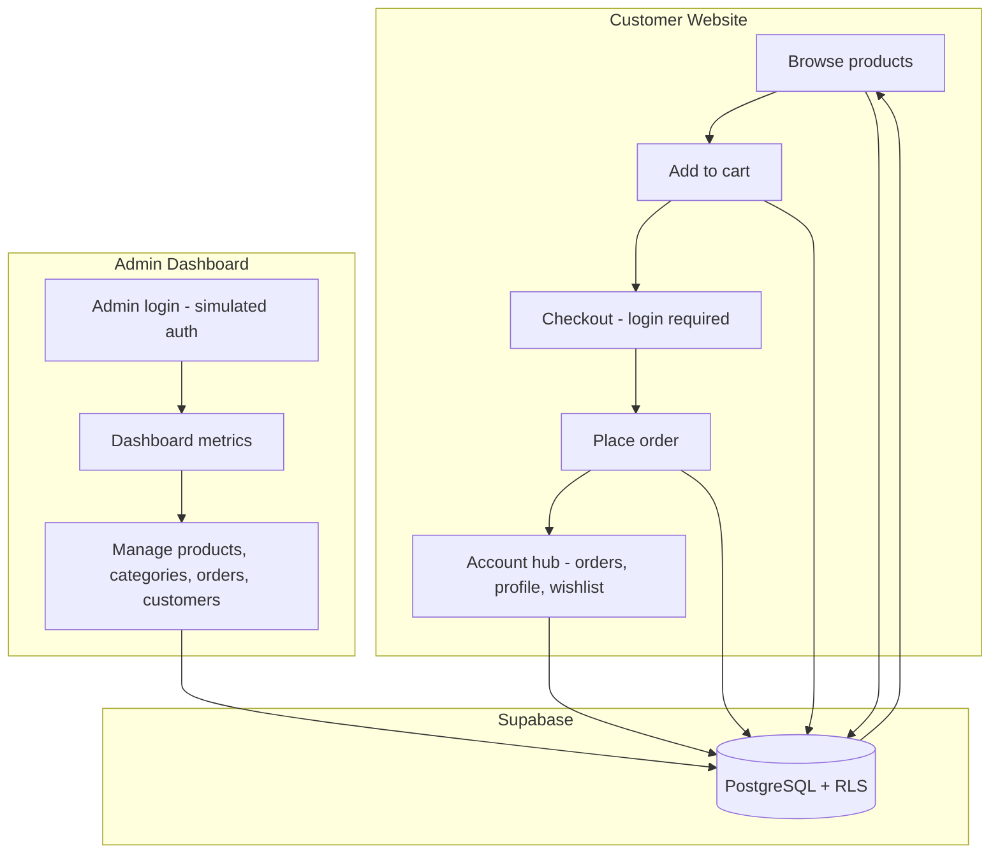

# Vellure — E-Commerce Website

CubeTech Web Development Intern Assessment submission. Full-stack e-commerce with a customer storefront and admin dashboard.

---

## Submission Requirements

| Requirement | Details |
|-------------|---------|
| **GitHub repository** | https://github.com/EarlClydeeee/vellure |
| **Live customer website** | _Replace after deploy — e.g. `https://vellure.vercel.app`_ |
| **Live admin dashboard** | _Same deployment — e.g. `https://vellure.vercel.app/admin/login`_ |
| **README with setup** | This file |
| **Admin login credentials** | See [Admin Login Credentials](#admin-login-credentials) |
| **Technologies used** | See [Technologies Used](#technologies-used) |
| **Desktop & mobile screenshots** | See [Screenshots](#screenshots) |
| **System flow explanation** | See [System Flow](#system-flow) |

> After deploying to Vercel, update the **Live customer website** and **Live admin dashboard** links in the table above and in your submission form.

---

## Admin Login Credentials

| Field | Value |
|-------|-------|
| **URL** | `/admin/login` (local: http://localhost:3000/admin/login) |
| **Username** | `admin` |
| **Password** | `admin1234` |

Authentication is **simulated** for the assessment: credentials are validated against `ADMIN_USERNAME` and `ADMIN_PASSWORD` in `.env.local`, and a secure HttpOnly session cookie is set. No Supabase account is required for admin access.

### Test customer (storefront login)

| Field | Value |
|-------|-------|
| **URL** | `/login` |
| **Email** | `test@gmail.com` |
| **Password** | `test1234` |

Created by [`supabase/migrations/005_seed_test_users.sql`](supabase/migrations/005_seed_test_users.sql). Use this account to test checkout, cart sync, and `/account/*` pages.

---

## Technologies Used

| Layer | Technology |
|-------|------------|
| Framework | [Next.js 16](https://nextjs.org/) (App Router) |
| Language | TypeScript |
| UI | React 19, [Tailwind CSS v4](https://tailwindcss.com/), [shadcn/ui](https://ui.shadcn.com/) |
| Database | [Supabase](https://supabase.com/) (PostgreSQL) |
| Customer auth | Supabase Auth (email/password) |
| Admin auth | Simulated session (env-based credentials + HttpOnly cookie) |
| Validation | [Zod](https://zod.dev/) |
| Icons | Lucide React |
| Runtime | Node.js 20+ |

---

## System Flow



**Short explanation**

1. **Browse** — Guests and customers view the home page, product listing (10+ products), and product details. Data is read from Supabase.
2. **Cart** — Guests store cart items in `localStorage`; logged-in customers sync cart rows to Supabase. The cart persists after refresh.
3. **Checkout** — Checkout requires customer login. Guest cart items merge into the database cart on sign-in.
4. **Order** — Customer submits delivery details, payment method (COD, E-Wallet, Bank Transfer), and optional notes. An order number and summary are shown on confirmation.
5. **Account** — Customers manage profile, addresses, wishlist, and order history with a status timeline at `/account/orders/[id]`.
6. **Admin** — Admin signs in at `/admin/login` with simulated credentials, then manages products, categories, orders, and customers from the dashboard.
7. **Sync** — Admin changes (product price, stock, status, categories) are stored in Supabase and reflected on the customer site immediately (e.g. inactive products are hidden from the storefront).

---

## Screenshots

Desktop and mobile screenshots are stored in [`docs/screenshots/`](docs/screenshots/).

| Area | Pages to capture |
|------|------------------|
| **Customer (desktop + mobile)** | Home, product listing, product details, cart, checkout, order confirmation |
| **Admin (desktop)** | Login, dashboard, products, orders, order details, customers |

See [`docs/screenshots/README.md`](docs/screenshots/README.md) for the full capture checklist and file naming convention.

---

## Getting Started

### Prerequisites

- Node.js 20+
- npm
- A [Supabase](https://supabase.com/) project (free tier is sufficient)

### Installation

1. **Clone the repository**

   ```bash
   git clone https://github.com/EarlClydeeee/vellure.git
   cd vellure
   ```

2. **Install dependencies**

   ```bash
   npm install
   ```

3. **Configure environment**

   ```bash
   cp .env.local.example .env.local
   ```

   Edit `.env.local` with your Supabase project URL, publishable/anon key, and admin credentials.

4. **Run database migrations**

   In the Supabase SQL Editor, run these files **in order**:

   - `supabase/migrations/001_initial_schema.sql`
   - `supabase/migrations/003_tier1_commerce.sql`
   - `supabase/migrations/005_seed_test_users.sql` — test customer account (see credentials below)

   Optional: `supabase/migrations/002_seed_products.sql` if you prefer SQL-only product seeding instead of the npm script.

5. **Seed sample data**

   ```bash
   npm run seed
   ```

   This creates categories, 10+ products with images, and a test customer account (if configured in env).

6. **Start the development server**

   ```bash
   npm run dev
   ```

7. **Open in browser**

   | App | URL |
   |-----|-----|
   | Customer site | http://localhost:3000 |
   | Admin login | http://localhost:3000/admin/login |

### Environment Variables

```env
# Supabase (Dashboard → Project Settings → API)
NEXT_PUBLIC_SUPABASE_URL=https://your-project.supabase.co
NEXT_PUBLIC_SUPABASE_PUBLISHABLE_KEY=your_publishable_key
# or: NEXT_PUBLIC_SUPABASE_ANON_KEY=your_anon_key

# Admin (simulated auth — match credentials above)
ADMIN_USERNAME=admin
ADMIN_PASSWORD=admin1234

# Optional — seed script / elevated writes
SUPABASE_SERVICE_ROLE_KEY=your_service_role_key

# Optional — test customer created by seed script
TEST_USER_EMAIL=test@gmail.com
TEST_USER_PASSWORD=test1234
```

---

## Deployment

Deploy to [Vercel](https://vercel.com):

1. Import the GitHub repository.
2. Add all environment variables from `.env.local` in the Vercel project settings.
3. Deploy — the customer site and admin dashboard share one deployment.
4. Update the **Live customer website** and **Live admin dashboard** links at the top of this README.

```bash
npx vercel --prod
```

Admin dashboard URL after deploy: `https://your-domain.vercel.app/admin/login`

---

## Features

### Customer Website

- Home: navigation, promo banner, categories, featured products, footer
- Product listing (10+ products): search, category filter, price sort, stock status
- Product details: image gallery, specs, quantity selector, related products, Buy Now
- Shopping cart: guest (`localStorage`) + authenticated (Supabase); persists on refresh
- Checkout: login required; COD, E-Wallet, Bank Transfer; order confirmation
- Account: profile, addresses, orders with tracking timeline, wishlist

### Admin Dashboard

- Simulated admin login
- Dashboard: total products, orders, pending orders, completed orders, customers, total sales
- Product CRUD: search, filter by category/status, delete confirmation
- Category CRUD: deletion blocked when products are assigned
- Order management: order table, status updates, order detail view
- Customer list: name, email, contact, order count, total purchases, account status

---

## Project Structure

```
src/
├── app/
│   ├── (store)/          # Customer storefront
│   │   ├── page.tsx      # Home
│   │   ├── products/     # Listing & details
│   │   ├── cart/         # Shopping cart
│   │   ├── checkout/     # Checkout & mock payment
│   │   ├── account/      # Profile, addresses, orders, wishlist
│   │   ├── login/        # Customer login
│   │   └── signup/       # Customer sign-up
│   ├── (admin)/admin/    # Admin dashboard
│   └── api/              # API routes (admin login/logout, etc.)
├── components/
│   ├── ui/               # shadcn/ui
│   ├── store/            # Customer components
│   └── admin/            # Admin components
├── lib/
│   ├── services/         # Database services
│   ├── validation/       # Zod schemas
│   └── cart/             # Guest cart & compare
└── middleware.ts         # Route protection (customer + admin)
```

---

## Assessment Compliance

This project meets the CubeTech Simple E-Commerce Website requirements:

- **Customer:** home, product listing (10+ products), product details, cart, checkout, order confirmation
- **Admin:** login, dashboard overview, product/category/order/customer management
- **Cross-cutting:** admin changes sync to the customer site, responsive layout, form validation

---

## License

MIT
