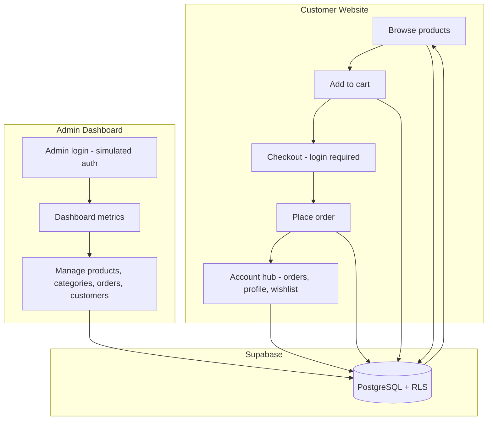

# Vellure — E-Commerce Website

CubeTech Web Development Intern Assessment submission. Full-stack e-commerce platform with a customer storefront and admin dashboard.

---

## Submission Details

| Requirement | Details |
|-------------|---------|
| **GitHub repository** | https://github.com/EarlClydeeee/vellure |
| **Live customer website** | http://localhost:3000 |
| **Live admin dashboard** | http://localhost:3000/admin/login |
| **Admin login credentials** | See [Admin Login Credentials](#admin-login-credentials) |
| **Technologies used** | See [Technologies Used](#technologies-used) |
| **Desktop & mobile screenshots** | See [Docs](#docs) |
| **System flow explanation** | See [System Flow](#system-flow) |

---

## Admin Login Credentials

| Field | Value |
|-------|-------|
| **URL** | `/admin/login` |
| **Email** | `admin@gmail.com` |
| **Password** | `admin1234` |

Admin authentication is simulated for this assessment: credentials are validated against environment variables and stored in an HttpOnly session cookie.

### Test Customer Account

| Field | Value |
|-------|-------|
| **URL** | `/login` |
| **Email** | `test@gmail.com` |
| **Password** | `test1234` |

Use this account to test checkout, cart sync, and customer account pages (`/account/*`).

---

## Technologies Used

| Layer | Technology |
|-------|------------|
| Framework | [Next.js 16](https://nextjs.org/) (App Router) |
| Language | TypeScript |
| UI | React 19, [Tailwind CSS v4](https://tailwindcss.com/), [shadcn/ui](https://ui.shadcn.com/) |
| Database | [Supabase](https://supabase.com/) (PostgreSQL) |
| Customer auth | Supabase Auth (email/password) |
| Admin auth | Simulated session (env-based credentials + HttpOnly cookie) |
| Validation | [Zod](https://zod.dev/) |
| Icons | Lucide React |
| Runtime | Node.js 20+ |

---

## System Flow



**How the system works**

1. **Browse** — Guests and customers view the home page, product listing (10+ products), and product details. Data is read from Supabase.
2. **Cart** — Guests store cart items in `localStorage`; logged-in customers sync cart rows to Supabase. The cart persists after refresh.
3. **Checkout** — Checkout requires customer login. Guest cart items merge into the database cart on sign-in.
4. **Order** — Customer submits delivery details, payment method (COD, E-Wallet, Bank Transfer), and optional notes. An order number and summary are shown on confirmation.
5. **Account** — Customers manage profile, addresses, wishlist, and order history with a status timeline at `/account/orders/[id]`.
6. **Admin** — Admin signs in at `/admin/login` with simulated credentials, then manages products, categories, orders, and customers from the dashboard.
7. **Sync** — Admin changes (product price, stock, status, categories) are stored in Supabase and reflected on the customer site immediately (e.g. inactive products are hidden from the storefront).

---

## Docs

Desktop and mobile screenshots are provided as PDFs in the [`docs/`](docs/) folder:

| View | File |
|------|------|
| **Desktop (laptop)** | [`docs/FOR LAPTOP VIEW.pdf`](docs/FOR%20LAPTOP%20VIEW.pdf) |
| **Mobile** | [`docs/FOR MOBILE VIEW.pdf`](docs/FOR%20MOBILE%20VIEW.pdf) |

---

## Getting Started

### Prerequisites

- Node.js 20+
- npm
- A [Supabase](https://supabase.com/) project

### Installation

1. Clone the repository

   ```bash
   git clone https://github.com/EarlClydeeee/vellure.git
   cd vellure
   ```

2. Install dependencies

   ```bash
   npm install
   ```

3. Configure environment

   ```bash
   cp .env.local.example .env.local
   ```

   Set your Supabase project URL, publishable key, and admin credentials in `.env.local`.

4. Run database migrations

   In the Supabase SQL Editor, run these files in order:

   - `supabase/migrations/001_initial_schema.sql`
   - `supabase/migrations/003_tier1_commerce.sql`
   - `supabase/migrations/005_seed_test_users.sql`

5. Seed sample data

   ```bash
   npm run seed
   ```

6. Start the development server

   ```bash
   npm run dev
   ```

7. Open in browser

   | App | URL |
   |-----|-----|
   | Customer site | http://localhost:3000 |
   | Admin login | http://localhost:3000/admin/login |

### Environment Variables

```env
NEXT_PUBLIC_SUPABASE_URL=https://your-project.supabase.co
NEXT_PUBLIC_SUPABASE_PUBLISHABLE_KEY=your_publishable_key

ADMIN_EMAIL=admin@gmail.com
ADMIN_PASSWORD=admin1234

SUPABASE_SERVICE_ROLE_KEY=your_service_role_key
TEST_USER_EMAIL=test@gmail.com
TEST_USER_PASSWORD=test1234
```

---

## Features

### Customer Website

- Home: navigation, promo banner, categories, deals, footer
- Product listing (10+ products): search, category filter, price sort, stock status
- Product details: image gallery, specs, quantity selector, related products, Buy Now
- Shopping cart: guest (`localStorage`) + authenticated (Supabase); persists on refresh
- Checkout: login required; COD, E-Wallet, Bank Transfer; order confirmation
- Account: profile, addresses, orders with tracking timeline, wishlist
- Responsive layout: 2-column product grid on mobile, full desktop layout on larger screens

### Admin Dashboard

- Simulated admin login
- Dashboard: total products, orders, pending orders, completed orders, customers, total sales
- Product CRUD: search, filter by category/status, delete confirmation
- Category CRUD: deletion blocked when products are assigned
- Order management: order table, status updates, order detail view
- Customer list: name, email, contact, order count, total purchases, account status

---

## Assessment Compliance

This project meets the CubeTech Simple E-Commerce Website requirements:

- **Customer:** home, product listing (10+ products), product details, cart, checkout, order confirmation
- **Admin:** login, dashboard overview, product/category/order/customer management
- **Cross-cutting:** admin changes sync to the customer site, responsive layout, form validation

---

## License

MIT
